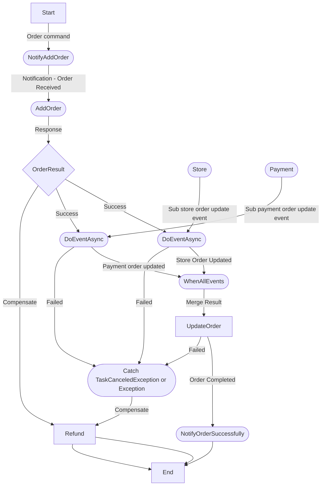

# E-shop 
> **Building a tech store application using microservices**
****

## Workflow Demo




## Scripts:

#### Add migration
```shell
dotnet ef migrations add "script name" -p src/PaymentService/Infrastructure -s src/PaymentService/API
dotnet ef migrations add "script name" -p src/OrderService/Infrastructure -s src/OrderService/API
dotnet ef migrations add "script name" -p src/CustomerService/Infrastructure -s src/CustomerService/API
```

#### Update database:
```shell
make update-payment-db
make update:order-db
make update-customer-db
```

## Run

#### Docker.
```shell
docker compose up --build
```