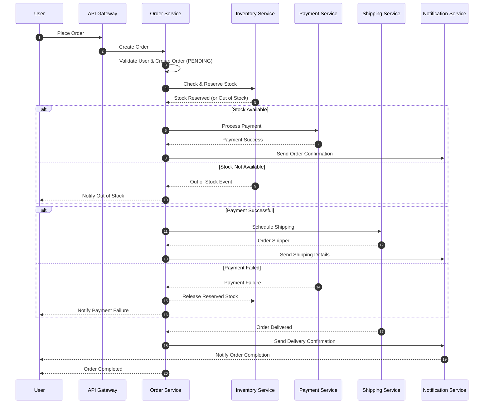

<h1 align="center">ESHOP AspNetCore WebAPI</h1>

  <a href="#about">About</a> &nbsp;&bull;&nbsp;
  <a href="#tech-stacks--researchs">Tech Stacks & Research</a> &nbsp;&bull;&nbsp
  <a href="#the-solution-architecture">The Solution Architecture</a> &nbsp;&bull;&nbsp;
  <a href="#how-to-run">How to run</a>  &nbsp;&bull;&nbsp;
  <a href="#references">References</a>

## About

This project was built as a learning to understand the concept of the **Clean Architecture** together with
Entity FrameworkCore as ORM and MediatR as CQRS library. The intend purpose was to build a simple store application,
where you can store and manage the products as an administrator, and able to order, online payment as the client.
 

### Structure Folder

| Service  |        Description        |             
|----------|:-------------------------:|
| Customer |    Managing customers     |        
| Order    | Managing order processing |            
| Product  |  Managing product items   |   
| Payment  |     Managing payment      |

## Tech Stacks & Researchs

- [x] AspNetCore 8 WebAPI (using **Minimal API**)
- [x] SwaggerUI
- [x] API Versioning
- [x] Onion architecture
- [ ] Authentication
- [x] Testing
- [x] Caching
- [x] Logging
- [x] Performance
- [x] Mapping (AutoMapper)
- [x] Background Jobs
- [x] Exception Handling
- [x] Code First Approach
- [x] Dependency injection
- [x] CRQS with MediatR library
- [x] MediatR pipelines for: Caching, Validation, Logging
- [x] Repository pattern
- [x] Option pattern
- [x] Dockerized
- [ ] CI/CD
- [ ] Kubernetes

### Performance

    
Async Projections

In a Command and Query Responsibility Segregation (CQRS) system, denormalized asynchronous projections can significantly
improve performance for several reasons:

- Improved Read Performance: In a CQRS system, the read side is separate from the write side and is optimized for
  querying data. By denormalizing the data in the projections, the read side can access
  the data it needs more efficiently, reducing the number of joins required to retrieve data and ultimately speeding up
  query performance.

- Reduced Latency: When data is denormalized, it's usually stored in a format that's more suitable for the specific use
  case. This can reduce the amount of data that needs to be retrieved from the
  database, which can help to minimize latency and improve the overall responsiveness of the system.

- Increased Scalability: Denormalized projections can handle a larger volume of data more efficiently than normalized
  ones. This is because denormalized data is usually stored in a format that's
  optimized for a specific use case, which allows the system to process the data more quickly and with less resources.

- Simpler Architecture: In a normalized data model, data is often spread out across multiple tables, which can make the
  system more complex to design, develop, and maintain. By denormalizing the data,
  it can be easier to manage and understand, which can simplify the overall architecture and make the system more
  maintainable.

- Improved Concurrency: Asynchronous projections allow multiple operations to be performed at the same time and,
  denormalized projections reduce contention, helping to improve concurrent write operation
  performance.

In summary, denormalized asynchronous projections in a CQRS system can help to improve performance by reducing latency,
increasing scalability, simplifying the architecture, and improving concurrency.
This results in a more responsive and efficient system that can handle larger volumes of data and more complex queries.

    
Snapshotting

> Snapshotting is an optimisation that reduces time spent on reading event from an event store.
>
> [Gunia, Kacper. "Event Sourcing: Snapshotting",
_domaincentric.net_, last edited on 5 Jun 2020](https://domaincentric.net/blog/event-sourcing-snapshotting)

More details in [snapshot](#snapshot) section.

    
Minimize Exceptions

> Exceptions should be rare. Throwing and catching exceptions is slow relative to other code flow patterns. Because of this, exceptions shouldn't be used to control normal program flow.
>
> Recommendations:
>
> - Do not use throwing or catching exceptions as a means of normal program flow, especially in hot code paths.
> - Do include logic in the app to detect and handle conditions that would cause an exception.
> - Do throw or catch exceptions for unusual or unexpected conditions.
> - App diagnostic tools, such as Application Insights, can help to identify common exceptions in an app that may affect performance.
>
> ["ASP.NET Core Performance Best Practices" _MSDN_, Microsoft Docs, last edited on 18 Fev 2022](https://docs.microsoft.com/en-us/aspnet/core/performance/performance-best-practices?view=aspnetcore-6.0#minimize-exceptions)

    
Pool HTTP connections with HttpClientFactory

> Closed `HttpClient` instances leave sockets open in the `TIME_WAIT` state for a short period of time. If a code path that creates and disposes of `HttpClient` objects is frequently used, the app may
> exhaust available sockets.
>
> Recommendations:
>
> - Do not create and dispose of HttpClient instances directly.
> - Do use HttpClientFactory to retrieve HttpClient instances.
>
> ["ASP.NET Core Performance Best Practices" _MSDN_, Microsoft Docs, last edited on 18 Fev 2022](https://docs.microsoft.com/en-us/aspnet/core/performance/performance-best-practices?view=aspnetcore-6.0#pool-http-connections-with-httpclientfactory)

DbContext Pooling

> The basic pattern for using EF Core in an ASP.NET Core application usually involves registering a custom DbContext type into the dependency injection system and later obtaining instances of that
> type through constructor parameters in controllers. This means a new instance of the DbContext is created for each request.
>
> In version 2.0 we are introducing a new way to register custom DbContext types in dependency injection which transparently introduces a pool of reusable DbContext instances. This is conceptually
> similar to how connection pooling operates in ADO.NET providers and has the advantage of saving some of the cost of initialization of DbContext instance.
>
> ["New features in EF Core 2.0" _MSDN_, Microsoft Docs, last edited on 11 Oct 2020](https://docs.microsoft.com/en-us/ef/core/what-is-new/ef-core-2.0/#dbcontext-pooling)

## The Solution Architecture

### Workflow

## How to run

Clone the repository `git clone https://github.com/luuthuong/eshop-microservices`

**In root directory**

`dotnet run --project .\src\ProductSyncService\ProductSyncService.API`

*Or docker:* `docker compose up --build`

## Authors
- [@luuthuong](https://www.github.com/luuthuong)
- 

## References

### Articles

- [Effective Aggregate Design Part I: Modeling a Single Aggregate](https://www.dddcommunity.org/wp-content/uploads/files/pdf_articles/Vernon_2011_1.pdf)
- [Effective Aggregate Design Part II: Making Aggregates Work Together](https://www.dddcommunity.org/wp-content/uploads/files/pdf_articles/Vernon_2011_2.pdf)
- [Effective Aggregate Design Part III: Gaining Insight Through Discovery](https://www.dddcommunity.org/wp-content/uploads/files/pdf_articles/Vernon_2011_3.pdf)
- [CQRS Documents - Greg Young](https://cqrs.files.wordpress.com/2010/11/cqrs_documents.pdf)
- [Versioning in an Event Sourced - Greg Young](https://leanpub.com/esversioning/read)
- [Clarified CQRS - Udi Dahan](https://udidahan.com/wp-content/uploads/Clarified_CQRS.pdf)

### Blogs

- [Event-driven IO - Oskar Dudycz](https://event-driven.io/)
- [Code Opinion - Derek Comartin](https://codeopinion.com/)
- [Domain Centric - Kacper Gunia](https://domaincentric.net/)
- [CQRS Event Sourcing - Daniel Whittaker](https://danielwhittaker.me/)
- [Event Store - Alexey Zimarev](https://www.eventstore.com/blog)
- [Mathias Verraes Student of Systems](https://verraes.net/)

### Posts

- [Modeling Uncertainty with Reactive DDD - Vaughn Vernon](https://www.infoq.com/articles/modeling-uncertainty-reactive-ddd/)
- [Reactive DDD—When Concurrent Waxes Fluent - Vaughn Vernon](https://www.infoq.com/presentations/reactive-ddd/)
- [Pattern: Event sourcing - Chris Richardson](https://microservices.io/patterns/data/event-sourcing.html)
- [Clarified CQRS - Udi Dahan](https://udidahan.com/2009/12/09/clarified-cqrs/)
- [Udi & Greg Reach CQRS Agreement](https://udidahan.com/2012/02/10/udi-greg-reach-cqrs-agreement/)
- [Event Sourcing and CQRS - Alexey Zimarev](https://www.eventstore.com/blog/event-sourcing-and-cqrs)
- [What is Event Sourcing? - Alexey Zimarev](https://www.eventstore.com/blog/what-is-event-sourcing)
- [Distilling the CQRS/ES Capability - Vijay Nair](https://axoniq.io/blog-overview/distilling-the-cqrses-capability)
- [Dispelling the Eventual Consistency FUD when using Event Sourcing - Vijay Nair](https://axoniq.io/blog-overview/dispelling-the-eventual-consistency-fud-when-using-event-sourcing)
- [Why would I need a specialized Event Store? - Greg Woods](https://axoniq.io/blog-overview/eventstore)
- [A Fast and Lightweight Solution for CQRS and Event Sourcing - Daniel Miller](https://www.codeproject.com/Articles/5264244/A-Fast-and-Lightweight-Solution-for-CQRS-and-Event)
- [Event Sourcing: The Good, The Bad and The Ugly - Dennis Doomen](https://www.continuousimprover.com/2017/11/event-sourcing-good-bad-and-ugly.html)
- [What they don’t tell you about event sourcing - Hugo Rocha](https://medium.com/@hugo.oliveira.rocha/what-they-dont-tell-you-about-event-sourcing-6afc23c69e9a)
- [Event Sourcing pattern - MSDN](https://docs.microsoft.com/en-us/azure/architecture/patterns/event-sourcing)
- [CQRS + Event Sourcing, Step by Step - Daniel](https://danielwhittaker.me/2020/02/20/cqrs-step-step-guide-flow-typical-application/)
- [Architectural considerations for event-driven microservices-based systems - Tanmay Ambre](https://developer.ibm.com/articles/eda-and-microservices-architecture-best-practices/)
- [How messaging simplifies and strengthens your microservice application - Callum Jackson](https://developer.ibm.com/articles/how-messaging-simplifies-strengthens-microservice-applications/)
- [Event Sourcing: Aggregates Vs Projections - Kacper Gunia](https://domaincentric.net/blog/event-sourcing-aggregates-vs-projections)
- [Event Sourcing: Projections - Kacper Gunia](https://domaincentric.net/blog/event-sourcing-projections)
- [Advantages of the event-driven architecture pattern - Grace Jansen & Johanna Saladas](https://developer.ibm.com/articles/advantages-of-an-event-driven-architecture/)
